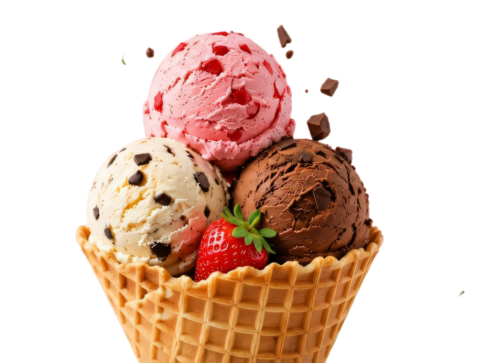

# 🍦 Antix — Artisanal Ice Cream Landing Page

<div align="center">

  

  <br><br>

  <h1>🍨 Scoop. Smile. Repeat! ✨</h1>

  <p><strong>A modern, responsive, and visually stunning landing page for an artisanal handcrafted ice cream brand.</strong></p>

  <p>
    <a href="https://frolicking-vacherin-5ee4b9.netlify.app/" target="_blank">
      
    </a>
    
    
    
  </p>

  <h3>
    🌐 <strong>Live Website:</strong> 
    <a href="https://frolicking-vacherin-5ee4b9.netlify.app/" target="_blank">
      https://frolicking-vacherin-5ee4b9.netlify.app/
    </a>
  </h3>

</div>

---

## 🎯 1. Objective
The primary objective of this project is to build an engaging, vibrant, and fully responsive **Landing Page** for **Antix**, an artisanal small-batch ice cream brand, as part of **Task 1 (Level 1)** of the **Oasis Infobyte (OIBSIP)** Web Development and Designing Internship.

The key objectives include:
- Creating an inviting, mouth-watering visual identity and digital storefront for an artisanal food brand.
- Demonstrating strong fundamentals of **semantic HTML5** layout structure, **vanilla CSS3** styling, flexbox/grid layout design, and responsive media queries without relying on third-party CSS frameworks.
- Organizing brand storytelling, flavor exploration, promotional offers, social proof, community engagement, and newsletter conversion into a cohesive user journey.
- Ensuring seamless cross-device compatibility across mobile phones, tablets, laptops, and ultra-wide desktop monitors.

---

## 🛠️ 2. Tools & Technologies Used
- **Markup & Structure:** Semantic HTML5 (`<header>`, `<nav>`, `<main>`, `<section>`, `<article>`, `<footer>`, `<figure>`, `<form>`).
- **Styling & Visual Design:** Vanilla CSS3 (Custom Properties / CSS Variables, Flexbox, CSS Grid, Glassmorphic frosted cards, circular halo frames, smooth hover transitions, keyframe animations).
- **Typography:** Google Fonts:
  - `Fredoka`: Playful, friendly rounded display typeface for high-impact headings.
  - `Plus Jakarta Sans`: Modern, legible geometric sans-serif for body text and navigation.
  - `Caveat`: Expressive handwritten script font for decorative accents and callouts.
- **Assets & Media:** High-resolution product imagery (flavors, cones, waffle bowls, community moments) and vector SVG icons.
- **Deployment & Hosting:** **Netlify** for continuous automated deployment and live web hosting.
- **Development Tools:** Visual Studio Code, Git, GitHub, and Chrome DevTools (Responsive Device Mode & CSS Inspector).

---

## 📋 3. Steps Performed
1. **Brand Concept & Color Palette Planning:**
   - Established the brand persona (*"Scoop. Smile. Repeat!"*) with a warm, playful color system using pastel pinks, sweet strawberry red, creamy vanilla, and refreshing mint turquoise.
   - Mapped out the customer conversion flow from first impression to flavor discovery and email signup.

2. **Semantic HTML5 Page Architecture (`index.html`):**
   - Structured 10 dedicated content sections:
     - **Sticky Top Navbar:** Custom branded logo, navigation links, search, cart counter, and "Order Now" CTA.
     - **Hero Section:** Headline typography, ingredient highlight pills, and floating customer rating badge (4.9 ★★★★★).
     - **Flavors Carousel:** Showcase of 5 signature flavors with circular halo frames and pagination indicators.
     - **Special Offers & Discounts:** Split promotional cards highlighting deals with price comparison tags.
     - **Core Value Highlights:** 4 key brand pillars (100% Natural, Handcrafted, Fast Delivery, Eco-Friendly).
     - **Our Story (About Us):** Brand journey and kitchen roots alongside team imagery.
     - **Testimonials Slider:** Verified customer reviews with 5-star badges and reviewer avatars.
     - **Community Photo Gallery & Stats:** 5-column social moment grid with like counts and key metrics (50K+ customers, 10K+ posts).
     - **Newsletter Signup:** Eye-catching peach card with perk badges and subscription form.
     - **Themed Footer:** Illustrated background, quick navigation links, social links, and copyright bar.

3. **CSS3 Design System & Visual Hierarchy (`style.css`):**
   - Defined global design tokens for typography, palette, spacing, and soft-radius container cards.
   - Built custom CSS Grid photo galleries and flexible Flexbox layout containers.
   - Crafted playful micro-interactions: card elevation on hover, button arrow slide transitions, and subtle pulse glows.

4. **Responsive Layout Engineering:**
   - Implemented mobile-first media queries targeting:
     - **Desktop & Large Screens (1200px – 1440px+)**: Spacious multi-column grids and balanced hero layouts.
     - **Tablets & Laptops (768px – 1024px)**: 2-column promo cards, adapted gallery columns, and condensed navigation.
     - **Mobile Devices (<768px & <480px)**: Single-column stacked cards, full-width touch-friendly buttons, and zero horizontal overflow.

5. **Testing, Optimization & Netlify Deployment:**
   - Validated HTML5 semantics and CSS syntax.
   - Optimized image delivery and asset loading performance.
   - Deployed the project live on Netlify and verified cross-browser compatibility across Chrome, Firefox, Safari, and Edge.

---

## 🏆 4. Outcome
- **Live Production Deployment:** A fast-loading, visually rich artisanal ice cream landing page accessible worldwide at:  
  👉 **[https://frolicking-vacherin-5ee4b9.netlify.app/](https://frolicking-vacherin-5ee4b9.netlify.app/)**
- **Pure Vanilla Implementation:** 100% vanilla HTML5 and CSS3 without external frameworks or dependencies, achieving high performance and clean maintainable code.
- **Flawless Responsiveness:** Seamless visual and functional experience across mobile phones, tablets, and desktop computers.
- **Internship Rubric Compliance:** Fully satisfies and exceeds all Level 1 Task 1 requirements for the Oasis Infobyte Web Development Internship.

---

## 🎨 Key Features & Sections Breakdown

### 1. 🧭 Sticky Modern Navigation Bar
- Custom `Antix` brand identity with stylized pink dot and accent mark.
- Anchor navigation links: Home, About Us, Flavors, Shop, Reviews, and Contact.
- Interactive search, cart badge with item counter, and a pill-shaped gradient **Order Now** CTA.

### 2. 🍧 Hero Section ("Scoop. Smile. Repeat!")
- High-impact headline with playful tri-color typography (`SCOOP. SMILE. REPEAT!`).
- **Feature Badges**: 100% Natural Ingredients, No Artificial Colors/Flavors, and Made with Love.
- **Rating Card**: Floating glassmorphic rating badge showcasing *4.9 ★★★★★ from 2K+ happy customers*.

### 3. 🍓 Flavors Showcase ("Our Delicious Creations")
- Handcrafted flavors: *Salted Caramel, Classic Vanilla, Chocolate Fudge, Pistachio Bliss,* and *Strawberry Burst*.
- Circular halo cards with zoom-on-hover micro-interactions and active pagination indicators.

### 4. 🎁 Special Offer & Discount Promo Section
- **Promo Card ("SWEET DELIGHT!")**: Turquoise card with chocolate-dipped ice cream bar artwork, special offer tag, and "Shop Now ➔" button.
- **Discount Card ("20% DISCOUNT")**: Soft blush pink card displaying price comparison discounts for *Fresh Strawberry ($3.99)*, *Belgian Chocolate ($3.99)*, and *Classic Vanilla ($3.99)*.

### 5. ⭐ Core Value Badges
- 4-column feature highlights: *Natural Ingredients, Handcrafted, Fast Delivery,* and *Eco Friendly*.

### 6. 📖 Our Story (About Us)
- Split brand story card highlighting passion, artisanal recipes, and local kitchen roots alongside team imagery.

### 7. 💬 Testimonials Slider ("Loved by Thousands")
- Customer reviews with 5-star ratings, reviewer avatars, and authentic customer feedback.

### 8. 📸 Community Gallery & Stats ("Shared With Our Community")
- **Teal Banner Card**: Two-column header with "SWEET MOMENTS" eyebrow and "Join Our Community ➔" CTA button.
- **5-Column Photo Grid**: Curated community moments with frosted glassmorphic like counter badges (`12.4K`, `8.7K`, `15.2K`, `9.8K`, `11.6K`).
- **Community Stats Bar**: 4 key metrics with pastel circular icons:
  - 👥 **50K+** Happy Customers
  - 📷 **10K+** Community Posts
  - 💛 **4.9/5** Average Rating
  - ⭐ **100+** Sweet Moments Daily

### 9. 💌 Newsletter Banner ("Stay Sweet with Antix!")
- Creamy peach card with "STAY SWEET" eyebrow and email subscription form.
- **3 Perk Badges**: *Exclusive Offers*, *New Flavor Alerts*, and *Sweet Inspiration*.

### 10. 🍨 Themed Footer
- Background decorated with `footer bg.png` featuring strawberry and chocolate chip scoops.
- Antix brand overview, Quick Links, Help & Support, 4 pastel brand-tinted social buttons (Instagram, Facebook, Twitter, YouTube), and copyright bar.

---

## 📁 File Structure

```text
OIBSIP/
└── WebDev-L1-Landing_Page/
    ├── assets/
    │   ├── community-1.jpg       # Community photo 1 (Girls with ice cream)
    │   ├── community-2.jpg       # Community photo 2 (Woman with strawberry cone)
    │   ├── community-3.jpg       # Community photo 3 (Friends with ice cream)
    │   ├── community-4.jpg       # Community photo 4 (Golden retriever with cone)
    │   ├── community-5.jpg       # Community photo 5 (Boy with chocolate ice cream)
    │   ├── flavor-1.jpeg         # Salted Caramel scoop
    │   ├── flavor-2.jpeg         # Classic Vanilla scoop
    │   ├── flavor-3.jpeg         # Chocolate Fudge scoop
    │   ├── flavor-4.jpeg         # Pistachio Bliss scoop
    │   ├── flavor-5.jpeg         # Strawberry Burst scoop
    │   ├── footer bg.png         # Footer background graphic
    │   ├── hero.jpeg             # Hero section background visual
    │   ├── icecreame.jpeg        # Promo banner ice cream bar graphic
    │   ├── newsletter.jpeg       # Newsletter waffle bowl visual
    │   └── our story.jpeg        # About section team visual
    ├── index.html                # Main semantic HTML structure
    ├── style.css                 # Comprehensive CSS design system & responsive styles
    └── README.md                 # Project documentation (Objective, Tools, Steps, Outcome)
```

---

## 💻 Getting Started Locally

To run this project locally on your machine:

1. **Clone the repository:**
   ```bash
   git clone https://github.com/PriyoGhosh02/OIBSIP.git
   ```

2. **Navigate into the project directory:**
   ```bash
   cd OIBSIP/WebDev-L1-Landing_Page
   ```

3. **Open `index.html` in your browser:**
   - Double-click `index.html` to open it directly in any web browser, OR
   - Run a local server:
     ```bash
     # Using Python 3
     python -m http.server 8000
     ```
   - Visit `http://localhost:8000` in your browser.

---

## 📜 License & Credits

- **Author**: Priyo Ghosh ([@PriyoGhosh02](https://github.com/PriyoGhosh02))
- **Track**: Oasis Infobyte (OIBSIP) Web Development Internship — Level 1 Task 1
- **Live URL**: [https://frolicking-vacherin-5ee4b9.netlify.app/](https://frolicking-vacherin-5ee4b9.netlify.app/)

<div align="center">
  <sub>Made with ❤️ and scoops of happiness for ice cream lovers everywhere!</sub>
</div>
