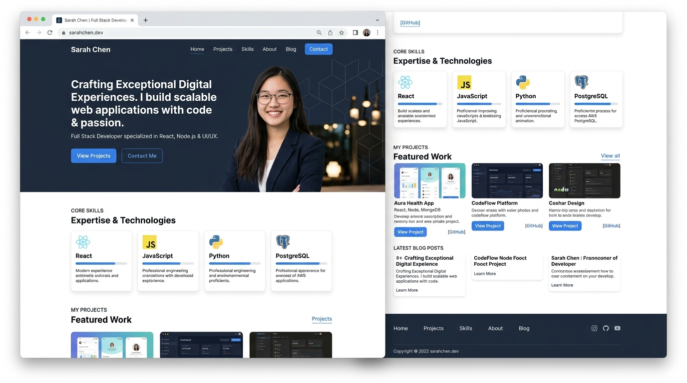

# 👨‍💻 Priyo Ghosh — Personal Portfolio Website

<div align="center">

  

  <br><br>

  <h1>🚀 Web Developer & Frontend Engineer ✨</h1>

  <p><strong>A modern, professional, and fully responsive personal portfolio showcasing full-stack capabilities, Shopify storefronts, and featured web applications.</strong></p>

  <p>
    <a href="https://sensational-brigadeiros-d1a387.netlify.app/" target="_blank">
      
    </a>
    
    
    
    
  </p>

  <h3>
    🌐 <strong>Live Website:</strong> 
    <a href="https://sensational-brigadeiros-d1a387.netlify.app/" target="_blank">
      https://sensational-brigadeiros-d1a387.netlify.app/
    </a>
  </h3>

</div>

---

## 📌 Developer Information
- **Developer:** Priyo Ghosh
- **Role:** Web Developer & Frontend Engineer
- **Track:** Web Development Internship (Oasis Infobyte — Level 1 Task 2)
- **Location:** Dhaka, Bangladesh (Remote Available)
- **Education:** B.Sc. in Computer Science and Engineering, Green University of Bangladesh (CGPA 3.44/4.00)
- **Email:** [priyoghosh02@gmail.com](mailto:priyoghosh02@gmail.com)
- **Phone:** [+8801743457164](tel:+8801743457164)
- **GitHub:** [https://github.com/PriyoGhosh02](https://github.com/PriyoGhosh02)
- **LinkedIn:** [https://linkedin.com/in/priyoghosh02](https://linkedin.com/in/priyoghosh02)

---

## 🎯 1. Objective
The primary objective of this project is to design and develop a modern, professional, and fully responsive **Personal Portfolio Website** for **Priyo Ghosh** as part of **Task 2** of the **Oasis Infobyte (OIBSIP)** Web Development Internship.

The key objectives include:
- Establishing a high-impact personal developer brand highlighting technical skills, real-world client projects (60+ Shopify storefronts, 30+ landing pages), academic achievements, and contact channels.
- Demonstrating strong fundamentals of **semantic HTML5**, modern **vanilla CSS3** layout architectures (Flexbox & CSS Grid), fluid typography with `clamp()`, and accessible UX without third-party frameworks.
- Providing seamless user interactions, smooth-scrolling navigation anchors, client-side contact form validation with interactive feedback toast alerts, and direct native download of `assets/resume.pdf`.
- Ensuring flawless cross-device responsiveness across smartphones, tablets, laptops, and high-DPI desktop screens.

---

## 🛠️ 2. Tools & Technologies Used
- **Core Markup:** Semantic HTML5 (`<header>`, `<nav>`, `<main>`, `<section>`, `<article>`, `<footer>`, ARIA accessibility attributes).
- **Styling & Design System:** Vanilla CSS3:
  - Custom Properties / CSS Variables for cohesive theming.
  - CSS Grid and Flexbox for adaptive responsive layouts.
  - Glassmorphic card styling with backdrop blur filters.
  - Fluid typography scaling with `clamp()`.
  - CSS keyframe micro-animations (waving hand, sparkle pulse, hover lift).
- **Client-Side Scripting:** Vanilla JavaScript (ES6+):
  - Sticky navbar scroll detection with dynamic backdrop blur.
  - Active section scrollspy highlighting via `IntersectionObserver`.
  - Accessible mobile drawer navigation toggle with backdrop dismissal and keyboard Escape support.
  - Client-side contact form validation and interactive toast notification system.
  - Direct resume download handling with user feedback.
- **Typography:** Google Fonts:
  - [Plus Jakarta Sans](https://fonts.google.com/specimen/Plus+Jakarta+Sans) (Modern, geometric sans-serif for UI and body text).
  - [Caveat](https://fonts.google.com/specimen/Caveat) (Expressive handwritten accent for hero annotation).
- **Icons & Graphics:** Authentic inline vector SVGs for all 12 technology logos, social media buttons, and UI action icons.
- **Assets & Media:** `assets/resume.pdf` for direct download, high-resolution portrait, and project showcase mockups.
- **Deployment & Hosting:** **Netlify** for continuous automated deployment and live web hosting.
- **Development Tools:** Visual Studio Code, Git, GitHub, Chrome DevTools, and local HTTP server.

---

## 📋 3. Steps Performed
1. **Requirements Analysis & Resume Synchronization:**
   - Evaluated the Task 2 internship evaluation criteria and visual design mockup.
   - Synchronized authentic developer information, metrics (2+ years exp, 90+ projects), academic credentials, contact info, and live repository links directly from `resume.pdf`.

2. **Semantic HTML5 Page Architecture (`index.html`):**
   - Built structured sections with clean semantic hierarchy:
     - **Sticky Navigation Bar:** Custom PG monogram logo, anchor links (`#home`, `#about`, `#skills`, `#projects`, `#contact`), and direct `Download CV` CTA.
     - **Hero Section:** Greeting, headline with gradient text, role, intro bio, dual action CTAs, developer portrait framed with radial ambient glow, handwritten note (*“Turn ideas into reality ⤶”*), and floating stats badge.
     - **About Me Section:** Two-column story layout detailing background, client achievements, and a 6-item information card (Name, Email, Phone, Location, Education, Availability).
     - **Skills Section:** 12-card responsive grid showcasing core proficiencies with authentic vector brand badges.
     - **Featured Projects:** Showcase cards with zoomable thumbnails, descriptions, technology tags, live demo links, and GitHub repository links.
     - **Contact Section:** Direct email CTA with sparkle accents, phone, social buttons, and an interactive message form.
     - **Footer:** Dark slate brand footer with navigation links and copyright notice.

3. **CSS3 Design System & Responsive Tokens (`style.css`):**
   - Defined centralized CSS variables for the color palette (`#2563EB` Royal Blue, `#60A5FA` Sky Blue, `#0F172A` Slate Navy, `#FFFFFF`, `#F8FAFC`).
   - Implemented strict `box-sizing: border-box;` and smooth scrolling behavior (`scroll-behavior: smooth;`).
   - Engineered responsive layout grids and cards with soft-radius borders and subtle elevation shadows.
   - Developed targeted media queries for desktop (`1200px+`), laptop/tablet (`1024px`, `768px`), and mobile viewports (`<480px`).

4. **Interactive JavaScript Features (`script.js`):**
   - Enabled sticky header styling with dynamic shadow and glassmorphic blur when scrolling.
   - Integrated `IntersectionObserver` scrollspy to auto-highlight active navigation links.
   - Connected both desktop and mobile "Download CV" buttons directly to `assets/resume.pdf` with feedback toast alerts.
   - Built an interactive contact form with client-side validation, error handling, submit state simulation, and success toast confirmation.

5. **Testing, Optimization & Netlify Deployment:**
   - Validated HTML5 and CSS3 syntax for standards compliance.
   - Verified that all assets (`style.css`, `script.js`, `resume.pdf`, and images) return HTTP 200 OK.
   - Deployed the project to Netlify and verified cross-device performance and responsive layout fidelity.

---

## 🏆 4. Outcome
- **Live Production Deployment:** Deployed live on Netlify and accessible worldwide at:  
  👉 **[https://sensational-brigadeiros-d1a387.netlify.app/](https://sensational-brigadeiros-d1a387.netlify.app/)**
- **Pixel-Perfect Design Fidelity:** Successfully translates the dark-to-light theme layout with polished visual hierarchy, elegant typography, and authentic developer branding.
- **100% Task 2 Compliance:** Fulfills every single requirement of the Oasis Infobyte Task 2 internship evaluation checklist.
- **Fully Responsive & Accessible:** Fluidly adapts to all screen sizes without horizontal overflow or layout breakage.
- **High Performance:** Pure HTML, CSS, and lightweight Vanilla JS with zero external dependencies for instantaneous page loads.
- **Integrated Resume:** Includes direct native download of `assets/resume.pdf` with feedback toast notifications.

---

## 🎨 Color Palette & Typography Summary

### Colors
- **Primary Accent:** `#2563EB` (Royal Blue)
- **Secondary Accent:** `#60A5FA` (Sky Blue)
- **Dark Theme (Hero, Nav, Footer):** `#0F172A` / `#0B1120`
- **Text:** `#0F172A` (Headings) / `#334155` (Body) / `#64748B` (Muted)
- **Backgrounds:** `#FFFFFF` (Primary) & `#F8FAFC` (Section Contrast)
- **Borders:** `#E2E8F0`

### Typography
- **Primary:** `Plus Jakarta Sans` (Weights: 400, 500, 600, 700, 800)
- **Accent:** `Caveat` (Handwritten hero note)

---

## 🚀 Featured Projects Included

1. **Personal Portfolio Website**
   - Responsive portfolio built with HTML5, CSS3, and JavaScript showcasing development projects and professional experience.
   - **Live Demo:** [https://sensational-brigadeiros-d1a387.netlify.app/](https://sensational-brigadeiros-d1a387.netlify.app/)
   - **GitHub:** [https://github.com/PriyoGhosh02/priyoghosh](https://github.com/PriyoGhosh02/priyoghosh)

2. **Antix – Ice Cream Landing Page**
   - Artisanal ice cream brand landing page built with HTML5 and CSS3 (Internship Task 1).
   - **Live Demo:** [https://frolicking-vacherin-5ee4b9.netlify.app/](https://frolicking-vacherin-5ee4b9.netlify.app/)
   - **GitHub:** [https://github.com/PriyoGhosh02](https://github.com/PriyoGhosh02)

3. **TimeCraft – Headless E-Commerce Application**
   - Modern headless eCommerce web application developed using React, Shopify, GraphQL, Tailwind CSS, and Vercel.
   - **Live Demo:** [https://timecraftswatches.vercel.app/](https://timecraftswatches.vercel.app/)
   - **GitHub:** [https://github.com/PriyoGhosh02/Hydrojen-and-Graphql](https://github.com/PriyoGhosh02/Hydrojen-and-Graphql)

---

## 📁 File Structure

```text
WebDev-L1-Personal_Portfolio/
├── assets/
│   ├── resume.pdf                 # Priyo Ghosh Resume (connected to Download CV)
│   └── images/
│       ├── favicon.svg            # PG Monogram Favicon
│       ├── priyo-portrait.jpg     # Hero developer portrait
│       ├── project-antix.jpg      # Antix Landing Page thumbnail
│       ├── project-portfolio.jpg  # Portfolio preview thumbnail
│       └── project-ecommerce.jpg  # E-Commerce preview thumbnail
├── index.html                     # Semantic HTML5 markup
├── style.css                      # Modern CSS3 styling & responsive media queries
├── script.js                      # Sticky navbar, drawer, scrollspy, contact interaction
└── README.md                      # Project documentation (Objective, Tools, Steps, Outcome)
```

---

## 💻 Getting Started Locally

To run this project locally on your machine:

1. **Clone the repository:**
   ```bash
   git clone https://github.com/PriyoGhosh02/OIBSIP.git
   ```

2. **Navigate into the project directory:**
   ```bash
   cd OIBSIP/WebDev-L1-Personal_Portfolio
   ```

3. **Open `index.html` in your browser:**
   - Double-click `index.html` to open directly in any web browser, OR
   - Run a local server:
     ```bash
     # Using Python 3
     python -m http.server 8080
     ```
   - Visit `http://localhost:8080` in your browser.

---

## 📋 Task 2 Checklist Verification
- [x] **Profile / Hero with Name:** Priyo Ghosh with vibrant gradient accent
- [x] **Role Title:** Web Developer & Frontend Engineer
- [x] **Professional Photo / Avatar:** High-resolution developer studio portrait
- [x] **About Me Section:** Background narrative and lifelong learning philosophy
- [x] **Information Card:** Name, Email, Phone (+8801743457164), Location, Education, Availability
- [x] **Technical Skills Section:** 12 technologies with custom vector SVG logos
- [x] **Featured Projects:** 3 project cards with descriptions, tags, and dual links
- [x] **Live Demo & GitHub Links:** Working external and internal links on every project
- [x] **Contact Section:** Direct email CTA, contact details, social icons, and interactive form
- [x] **Resume Download:** Direct link to `assets/resume.pdf` on nav and mobile drawer
- [x] **Smooth-Scroll Navigation:** Anchor links with scroll-padding offset
- [x] **Consistent Branding & Colors:** `#2563EB`, `#60A5FA`, `#0F172A`, `#FFFFFF`, `#F8FAFC`
- [x] **Fully Responsive:** Tested across Mobile (<480px), Tablet (768px-1024px), Desktop (1200px+)
- [x] **Live Deployment:** Deployed on Netlify at [https://sensational-brigadeiros-d1a387.netlify.app/](https://sensational-brigadeiros-d1a387.netlify.app/)

---

## 📜 License & Credits

- **Author**: Priyo Ghosh ([@PriyoGhosh02](https://github.com/PriyoGhosh02))
- **Track**: Oasis Infobyte (OIBSIP) Web Development Internship — Level 1 Task 2
- **Live URL**: [https://sensational-brigadeiros-d1a387.netlify.app/](https://sensational-brigadeiros-d1a387.netlify.app/)

<div align="center">
  <sub>Designed &amp; Developed with ❤️ by Priyo Ghosh</sub>
</div>
